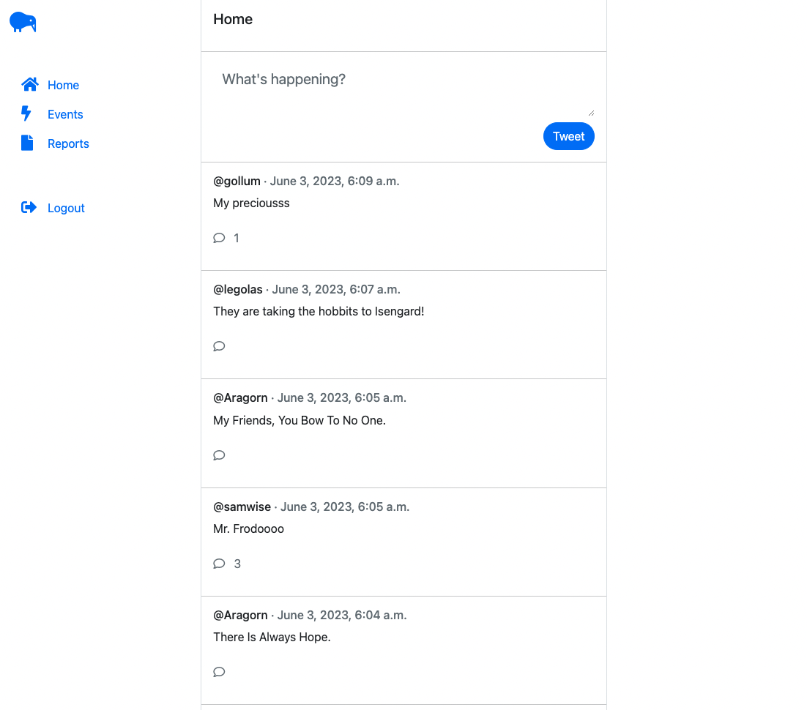
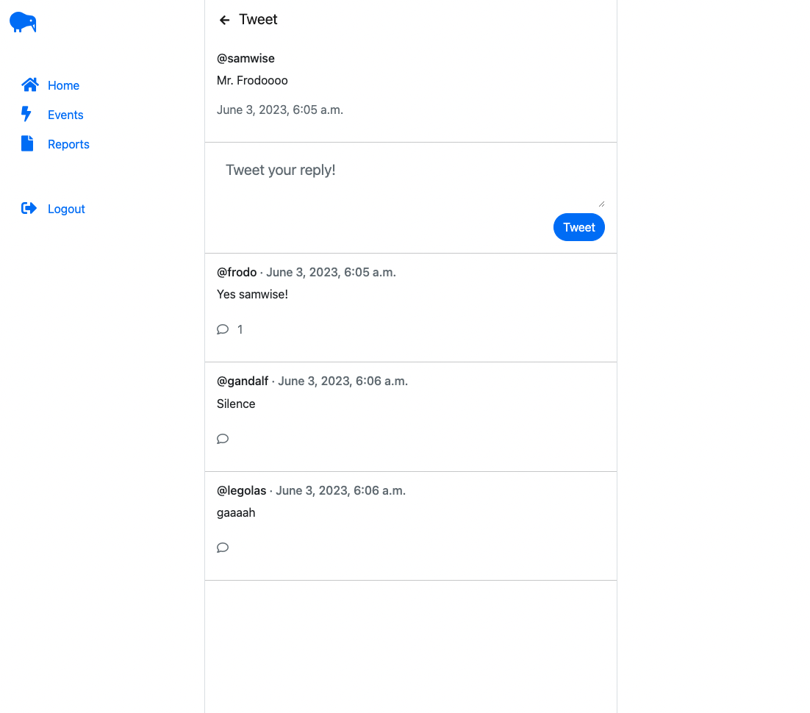
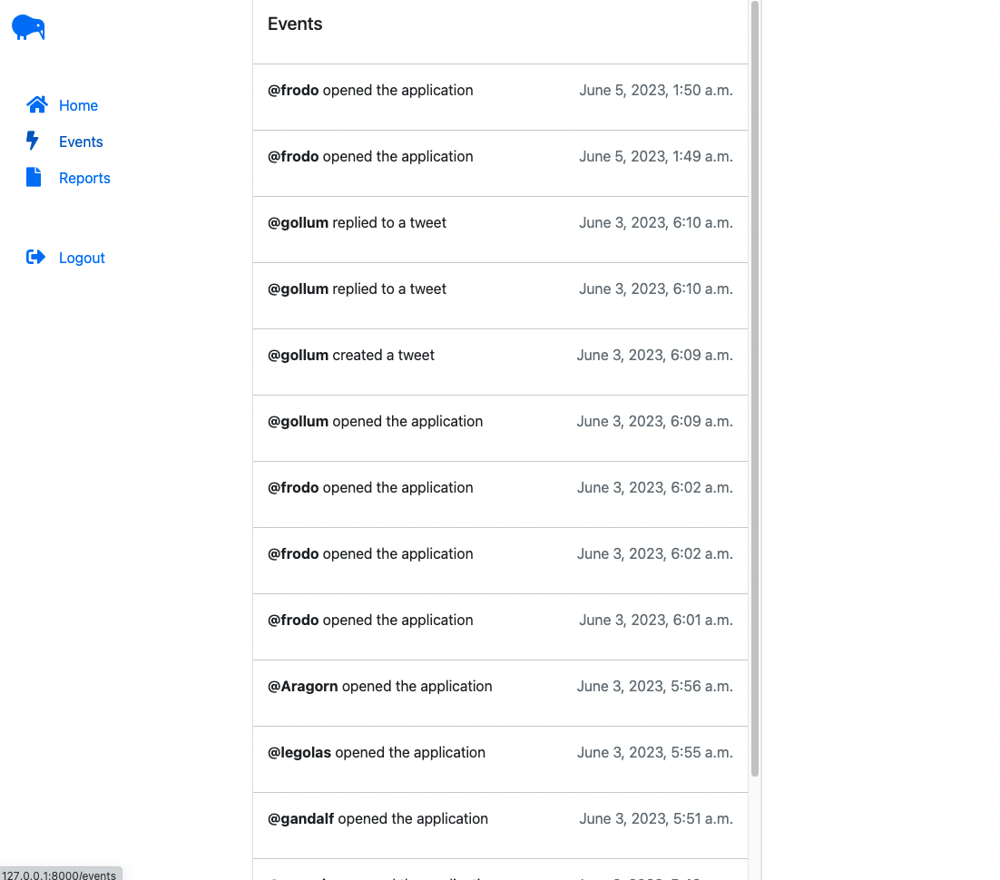
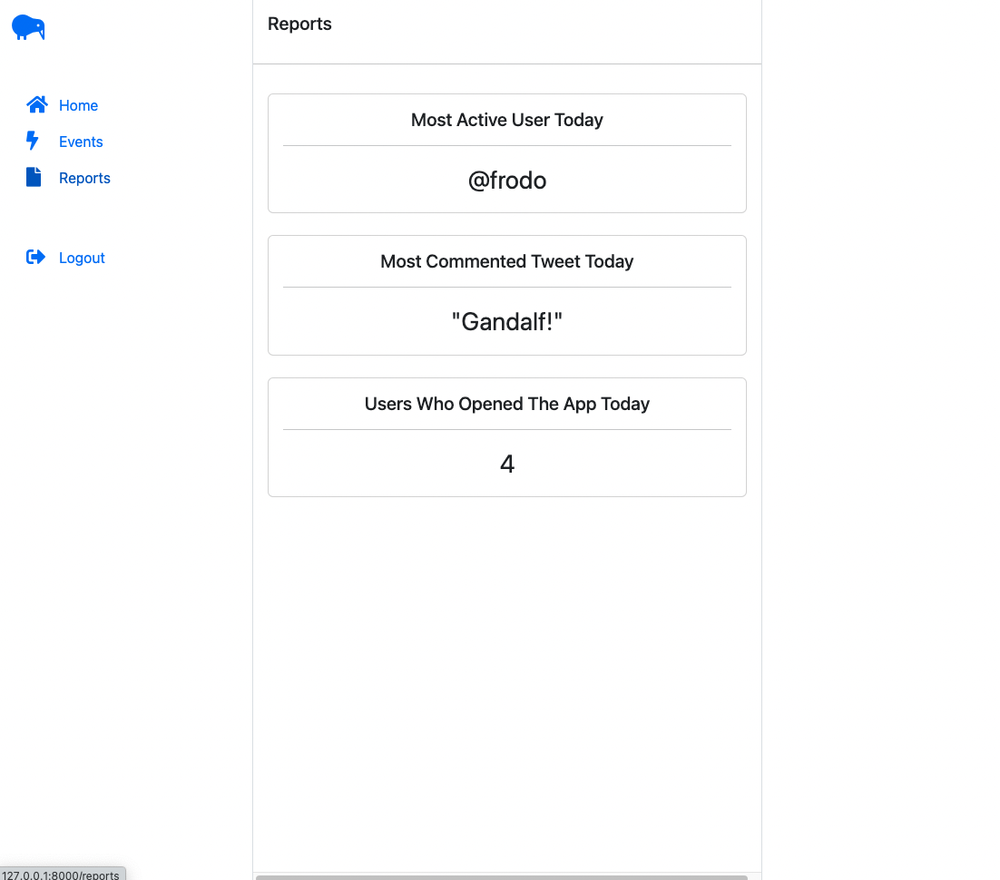

# :bird: Twitter Reloaded

Twitter Reloaded is a Twitter clone project built using Django, Python, and SQLite. The project aims to implement core Twitter features, such as creating tweets, replying to tweets, and displaying tweets as threads. Also includes an event list for all user actions and a reports dashboard displaying different statistics.


## :star: Features

- Create tweets with a maximum of 300 characters
- Reply to tweets
- Display tweets with replies as threads
- Display the recent 10 tweets on the home dashboard
- Event dashboard that logs user actions and provides reports

## :mag: Prerequisites

- Python 3.9
- pip

## :computer: Installation

1. Clone the repository to your local machine:
    ```zsh
    git clone https://github.com/yourusername/twitter_reloaded.git
    ```
2. Navigate to the project directory:
    ```zsh
    cd twitter_reloaded
    ```
3. Create a virtual environment to isolate your project dependencies:
    ```zsh
    python -m venv venv
    ```
4. Activate the virtual environment:

   - On macOS and Linux:

     ``` zsh
     source venv/bin/activate
     ```

   - On Windows:

     ```
     .\venv\Scripts\activate
     ```
5. Install the required packages from the `requirements.txt` file:
  ``` zsh
  pip install -r requirements.txt
  ```


## :rocket: Running the project

1. Start the development server:
    ``` zsh
    python manage.py runserver
    ```

## :balance_scale: SOLID Principles
- **Single Responsibility Principle (SRP)**: We divided our Django project into three apps: users, tweets, and events. Each app has its own responsibility, maintaining the separation of concerns and making each part easier to manage and maintain.

- **Open-Closed Principle (OCP)**: We have written our models in such a way that we can extend their functionality without modifying the existing code. For instance, we can add more event types to the Event model without modifying its existing structure.

- **Liskov Substitution Principle (LSP)**: We've ensured that child models in our Django models can substitute their parent models without affecting the integrity of the application. This applies to the "Tweet" model and its "replies", which are also instances of the "Tweet" model.

- **Interface Segregation Principle (ISP)**: Each view exposes a simple interface to the template that it renders. We don't burden any view or model with methods or attributes that it doesn't need.

- **Dependency Inversion Principle (DIP)**: Our Django models depend on abstractions, not on concrete implementations. For instance, the "Tweet" model depends on the abstract "User" model provided by Django, not on a specific implementation of a user.

## :art: Design Patterns
- **Decorator Pattern**: Django's views can be wrapped in decorator functions that modify their behavior. For instance, we used the `@login_required` decorator redirects unauthenticated users to the login page.

- **Factory Pattern**: Django's ORM uses a kind of Factory pattern to create model instances. When we call `Tweet.objects.create(...)`, we're using a factory to create a new Tweet.

- **Model-View-Template (MVT)**: Django's variant of MVC, MVT separates the concern of storing data (Model), displaying data (Template), and the logic to serve these (View).

## :gear: Functional Requirements
1. **User Authentication System:**
- User registration (sign up)
- User login
- User logout
- Password recovery (optional)
2. **Tweet Management System:**
- Create a new tweet (limited to 300 characters)
- Reply to a tweet (creating a threaded conversation)
- Retrieve and display tweets and threads for a user's home dashboard (showing the 10 most recent tweets)
3. **Event Dashboard System (Admin only):**
- Log events for various actions (create tweet, reply tweet, open application)
- Store event data, including action type, user who performed the action, and timestamp
- Generate reports based on event data, answering the following questions:
    - Which user registered the most events during the day?
    - What is the most commented tweet of the day?
    - How many users opened the application during the day?

## :stopwatch: Non Functional Requirements
1. **Maintainability:** The codebase should be well-organized, modular, and adhere to best practices (e.g., SOLID principles and design patterns), making it easier to maintain and extend in the future.
2. **Performance:** The application should respond to user requests quickly, ensuring a smooth user experience.
3. **Security:** The application should implement measures to protect user data, such as secure storage of passwords and protection against common web vulnerabilities.

## :camera: Screenshots
### Home
<kbd>
  
</kbd>

### Thread

<kbd>
  
</kbd>

### Events
<kbd>
  
</kbd>

### Reports
<kbd>
  
</kbd>
